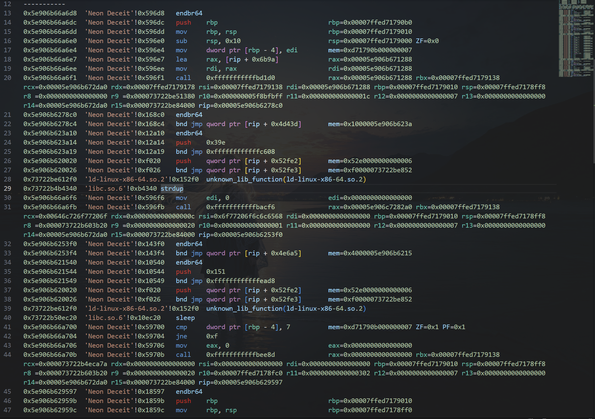

# Ltrace
Ltrace 是一个在linux x64下基于capstone和libdebug开发的指令trace工具。它拥有超快的速度，和一定的反混淆和反反调试能力。

Ltrace支持通过文件直接启动或者pid附加进行，支持添加启动参数和环境变量，可以指定位置开始追踪，并且添加用于标准输入流的交互数据。

注意!!!, 通过pid进行附加需在 ptrace_scope 中许可非父进程附加程序。

目前项目还在努力完善中，难免会有bug，如有问题可在issue中提出。

### 特点

- 快速：Ltrace 使用libdebug进行程序流的追踪和内存访问， 通过capstone进行轻量级反汇编，拥有大约18秒追踪十万执行流的能力(可能因为系统性能有所不同)。
- 标准库函数符号：通过对程序的依赖库解析和流程进行追踪，实时获取标准库符号，这使得执行程序可以简洁地显示标准库函数的符号，并且省略进入标准库的执行内容。
- 抗标准函数名称混淆：Ltrace 对链接器的流程进行了处理，可以直接输出通过plt和got第一次获取函数时，链接器获取的标准函数，这让Ltrace 拥有了对抗got表标准函数名混淆的能力，同时也因为Ltrace只解析真正执行的函数符号，而不是程序自带的函数符号。
- 详细的寄存器：我们在追踪过程中详细地打印了寄存器地值，便于您观察数据地变化。
- 显示内存中的值：通过libdebug实现了获取内存中的内容，而不仅仅是寄存器中的值，未来我们还计划添加内存查看和字符串识别功能。
- 反反调试：libdebug 中自带了绕过ptrace的功能，这可以让Ltrace绕过基础的反调试，我们在未来也计划添加更多的反调试绕过功能。
- 线程追踪： 计划在未来实现指定线程追踪，而不单单是主线程。
- 高拓展：libdebug 是一款易于上手的自动调试工具，您可以基于源码进行修改，在程序运行中进行任何操作，打造特定的追踪程序，包括hook系统调用，自动化获取内存内容进行数据处理等强大功能。
- 自动交互：Ltrace可以预设需要用于与程序进行交互用到的文字，在程序需要提供标准输入时自动提供您输入的内容，这意味着您不必要在处理完输入交互后再进行程序的追踪。

### 依赖

注意：[libdebug](https://github.com/libdebug/libdebug/tree/d88a893963d02482e00d4516bdaf4f25a8c14c4b)  的使用还需要安装额外的依赖库，请到github页面根据系统信息安装。

```
pip install capstone libdebug pwntools pyelftools 
```

### 使用方法

```
usage: Ltrace.py [-h] (-f FILE | -p PID) [-F FILEPATH] [-s START] [-m MAX_TRACE] [-e [ENV ...]] [-o OUTPUT] [-i [INPUT ...]] [-a ...]

Linux trace tool

options:
  -h, --help            show this help message and exit
  -f, --file FILE       需要启动的程序路径
  -p, --pid PID         要attach的进程ID
  -F, --filepath FILEPATH
                        程序文件路径(在通过pid附加时必须使用，通过文件启动请使用 -f)
  -s, --start START     可选参数，开始追踪的地址(十六进制，整数)，默认从入口点开始
  -m, --max-trace MAX_TRACE
                        可选参数，最大的追踪数量，默认100000条
  -e, --env [ENV ...]   程序运行需要的环境变量，多个环境变量以空格分隔，例如, KEY1=VAL1 KEY2=VAL2
  -o, --output OUTPUT   可选参数，指定输出的文件路径,默认 ./Ltrace.asm
  -i, --input [INPUT ...]
                        可选参数，程序使用标准输入流需要输入的数据，多个数据用空格分隔,例如: data1 data2 data3
  -a, --args ...        可选参数，添加程序的启动参数，只有再选择通过文件启动才有效，多个参数用空格分隔(只能放在最后一个参数)
```

### 效果展示

推荐使用vscode中的插件ASM Code Lens浏览asm文件。




### 未来计划

1.兼容x32

2.添加更多的反调试绕过功能

3.性能优化

4.跳转提示

5.内存dump

6.字符串识别

---

### 感谢
[libdebug](https://github.com/libdebug/libdebug/tree/d88a893963d02482e00d4516bdaf4f25a8c14c4b)

[capstone](https://github.com/capstone-engine/capstone)