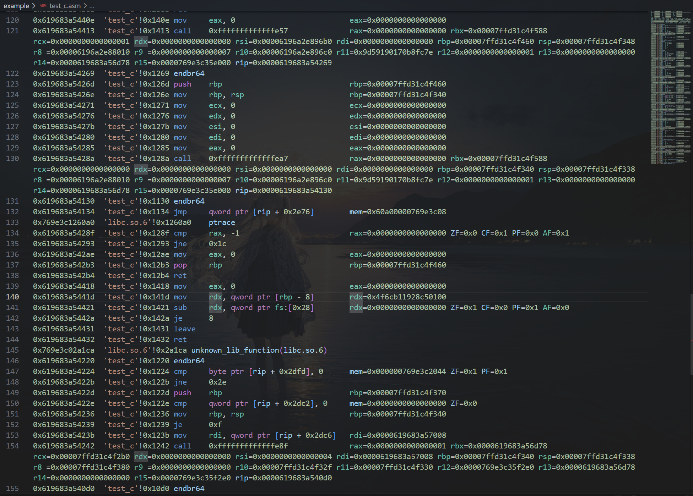

# Ltrace

[简体中文](README.zh-CN.md)

Ltrace is an instruction tracing tool for Linux x86/x64, built on the Capstone disassembly framework and the `libdebug` library. It boasts high-speed performance and includes capabilities for anti-obfuscation and anti-anti-debugging.

Ltrace supports tracing by launching a file directly or by attaching to a running process ID (PID). It allows for specifying command-line arguments, environment variables, a custom starting address for the trace, and pre-configured data for standard input interaction.

The project is currently under active development. If you encounter any problems, please feel free to [open an issue](https://www.google.com/search?q=https://github.com/your-repo-link/issues).

### Features

- **Fast**: Ltrace uses `libdebug` for tracing program flow and memory access, and `capstone` for lightweight disassembly. It can trace approximately 100,000 instructions in about 18 seconds (performance may vary depending on system specifications).
- **Standard Library Symbol Resolution**: By parsing the program's dependencies and tracing its execution flow, Ltrace resolves standard library symbols in real-time. This allows for a clean display of standard library function calls while skipping the trace of their internal execution. We plan to improve C++ symbol resolution in the future.
- **Resistant to GOT Obfuscation**: Ltrace handles the linker's resolution process, allowing it to directly output the standard function names as they are resolved via the PLT and GOT for the first time. This makes Ltrace effective against Global Offset Table (GOT) obfuscation, as it resolves symbols based on actual execution rather than relying on the potentially misleading symbols embedded in the binary.
- **Detailed Register View**: During the trace, register values are printed in detail, making it easy to observe data changes as the program executes.
- **Memory Value Display**: Leveraging `libdebug`, Ltrace can display content directly from memory, not just register values. We plan to add full memory dumping and string recognition features in the future.
- **Anti-Anti-Debugging**: Ltrace provides a built-in bypass for basic `ptrace`-based anti-debugging checks. We plan to add more advanced anti-debugging techniques in the future.
- **Highly Extensible**: `libdebug` is an easy-to-use automated debugging tool. You can modify the Ltrace source code to build custom tracing programs, adding powerful features like hooking system calls or automating data extraction and processing from memory.
- **Automated Interaction**: Ltrace allows you to pre-configure text for interaction with the target program. It automatically provides this input when the program reads from standard input, meaning you don't have to manually handle input prompts before the tracing can proceed.

### Notes

- Attaching to a process via PID requires appropriate permissions. You may need to disable YAMA's ptrace scope by running: `echo 0 | sudo tee /proc/sys/kernel/yama/ptrace_scope`.
- The tool automatically detects whether the target is an x86 (32-bit) or x64 (64-bit) binary.
- You might see output like `"unknown_lib_function(ld-linux-x86-64.so.2)"`. This typically occurs because the function is an internal routine used by the dynamic linker and is not an exported symbol. It's recommended to use a binary analysis tool like IDA Pro or Ghidra for further investigation.
- If you plan to modify Ltrace using the `libdebug` API, be aware that system stop events in `libdebug` may not be reliably triggered during a `step()` operation. This means you might not be able to intercept system calls or use other APIs that depend on stop events.
- When analyzing C++ programs, you may encounter mangled symbol names like `_ZStlsISt11char_traitsIcEERSt13basic_ostreamIcT_ES5_PKc`. This is standard C++ name mangling. We plan to add automatic demangling in the future. For now, you can use the `c++filt` utility to demangle these names manually.

### Dependencies

**Note**: `libdebug` has additional system-level dependencies. Please visit the official [libdebug GitHub repository](https://github.com/libdebug/libdebug) and follow the installation instructions for your operating system.

```Bash
pip install capstone libdebug pwntools pyelftools
```

### Usage

The help messages from the script have been translated below.

```
usage: Ltrace.py [-h] (-f FILE | -p PID) [-F FILEPATH] [-s START] [-m MAX_TRACE] [-e [ENV ...]] [-o OUTPUT] [-i [INPUT ...]] [-pa {0,1}] [-a ...]

A simple instruction tracer for Linux ELF binaries.

options:
  -h, --help            show this help message and exit
  -f FILE, --file FILE  The path of the program to execute and trace.
  -p PID, --pid PID     The Process ID (PID) to attach to for tracing.
  -F FILEPATH, --filepath FILEPATH
                        The program's file path (required when attaching with -p/--pid).
  -s START, --start START
                        Optional: The address (hex or int) to start tracing from. Defaults to the entry point.
  -m MAX_TRACE, --max-trace MAX_TRACE
                        Optional: The maximum number of instructions to trace. Defaults to 1,000,000.
  -e [ENV ...], --env [ENV ...]
                        Optional: Environment variables for the program, e.g., KEY1=VAL1 KEY2=VAL2.
  -o OUTPUT, --output OUTPUT
                        Optional: The path for the output trace file. Defaults to ./Ltrace.asm.
  -i [INPUT ...], --input [INPUT ...]
                        Optional: Data to send to the program's standard input, separated by spaces.
  -pa {0,1}, --pass-antidebug {0,1}
                        Optional: Enable anti-debugging bypass. 0=disabled, 1=enabled. Default: 0.
  -a ..., --args ...    Optional: Arguments for the program being traced. This must be the final option provided.
```


### Demo

It is recommended to use the **ASM Code Lens** extension in VS Code for viewing the output `.asm` file.

**De-obfuscating a GOT in r3ctf2025:**


**`ptrace` Anti-Debugging Bypass:**



### Future Plans


1. Add more anti-debugging bypasses.
2. Implement performance optimizations.
3. Add jump indicators to show where conditional jumps are headed.
4. Develop full memory dumping functionality.
5. Incorporate automatic string recognition from memory.
6. Integrate automatic C++ symbol demangling.
7. Add support for resolving symbols from libraries loaded at runtime (via `dlopen`).

------


### Acknowledgments


- [libdebug](https://github.com/libdebug/libdebug/tree/d88a893963d02482e00d4516bdaf4f25a8c14c4b)
- [Capstone Engine](https://github.com/capstone-engine/capstone)